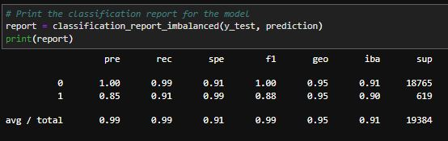
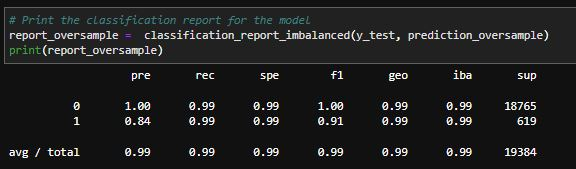

# Module 12 Report

## Overview of the Analysis

In this section, describe the analysis you completed for the machine learning models used in this Challenge. This might include:

* The challenge is identify the accuracy of the Lo`LogisticRegression` Model on predicting credit risk.
* Predicted healthy loans had shown 100% while prediction on the high-risk loans had 85% accuracy
* Had to oversampled the data to find any differences. Overall, it had shownn better predictions on high-risk loans by 3% where f1 score has moved to 91% from 88% using the oversampled data

## Results

Using bulleted lists, describe the balanced accuracy scores and the precision and recall scores of all machine learning models.

* Machine Learning Model 1:
  * Balanced Accuracy Score : 0.9520479254722232
  * Precision : 99%
  * Recall : healthy loans=99%; high-risk=91%

* Machine Learning Model 2:
  * Balanced Accuracy Score : 
  * Precision : 
  * Recall : 

## Summary

